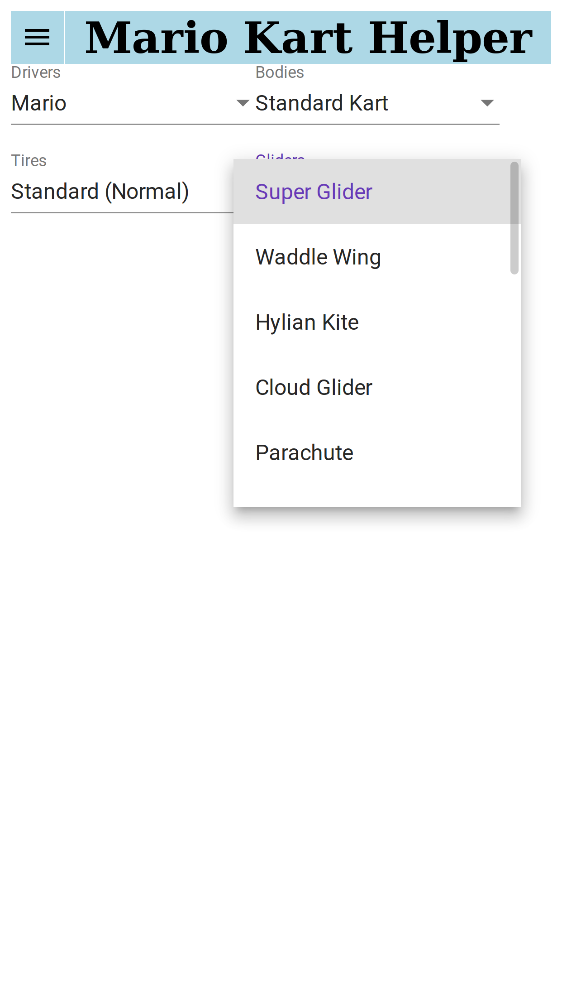

# Mario Kart Helper :warning: :construction: :bangbang:

[![MIT License][mit-license-button]][mit-license]

[mit-license-button]: https://img.shields.io/badge/license-MIT-green.svg

[mit-license]: https://opensource.org/licenses/MIT

- Mario Kart helper assist you to choose a suitable vehicle to fulfill your taste or competition needs.
- It is only for Nintendo Switch™

## Table Of Content

- [Project 'Kanban'](https://github.com/bugtamer/mario-kart-helper/projects) :clipboard:
- [User stories](./docs/user_stories/README.md)
- [Sketches](./docs/sketches/README.md)
- [Mockups](./docs/mockups/README.md)
- [Project requirements](./docs/requirements.md)
- [Angular/CLI info](./docs/angular-cli-info.md)
- [Angular Material](./docs/material_angular/material_angular.md)
- [Testing](./docs/testing/README.md)
- [Troubleshooting](./docs/troubleshooting/README.md)
- [Markdown emojis](https://www.webpagefx.com/tools/emoji-cheat-sheet/) :wink:
- Licenses
  - [Project license](./LICENSE)
  - Some images could have a different licence from the project.
    Those image licenses are in its own folder.

## Snapshots :warning: :construction: :bangbang:

